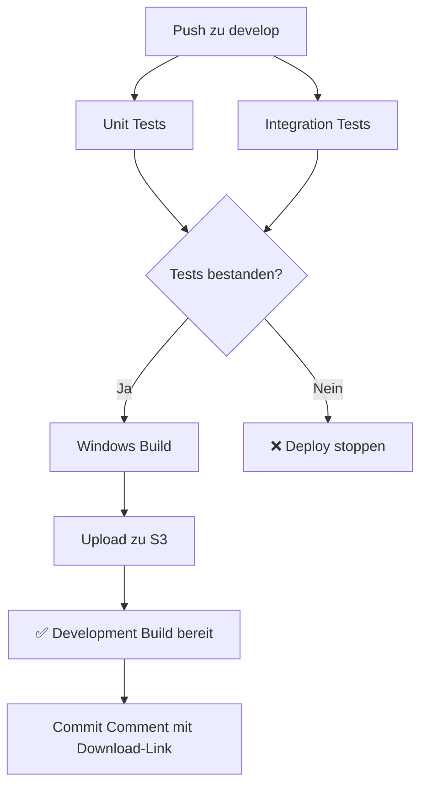

# 🚀 Development Deployment System

Das Development-Deployment-System ermöglicht automatische Test-Builds für den `develop` Branch.

## 📋 Übersicht

- **Trigger:** Push zu `develop` Branch
- **Tests:** Vollständige Unit & Integration Tests
- **Build:** Windows EXE mit Development-Konfiguration
- **Deploy:** S3 Bucket `switchfast-develop`
- **Zugriff:** Öffentliche Download-URLs

## 🔄 Workflow



## 📁 S3 Bucket Struktur

```
switchfast-develop/
├── latest/                     # Aktuelle Development Version
│   ├── switchfast-dev.exe     # Installer
│   ├── latest.yml             # Auto-Update Metadata
│   └── build-info.json        # Build-Informationen
└── builds/                     # Versionierte Builds
    ├── 0.1.2-dev-abc123/       # Build mit Commit Hash
    ├── 0.1.2-dev-def456/
    └── ...
```

## 🎯 Verwendung

### 1. Automatischer Trigger

```bash
# Development Branch erstellen/wechseln
git checkout -b develop  # Falls noch nicht existiert
git checkout develop

# Änderungen pushen
git add .
git commit -m "Feature: Neue Funktionalität"
git push origin develop      # 🚀 Triggert automatischen Build
```

### 2. Manueller Trigger

Über GitHub Actions Web-Interface:

1. Gehe zu **Actions** Tab
2. Wähle **Development Build & Deploy**
3. Klicke **Run workflow**
4. Optional: **Force deploy** auch bei Testfehlern

### 3. Download der Test-EXE

Nach erfolgreichem Build:

**Aktuellste Version:**

```
https://switchfast-develop.s3.eu-west-1.amazonaws.com/latest/switchfast-dev.exe
```

**Spezifische Build:**

```
https://switchfast-develop.s3.eu-west-1.amazonaws.com/builds/0.1.2-dev-abc123/switchfast-dev.exe
```

## 📦 Build-Eigenschaften

### Development vs. Production

| Eigenschaft | Development              | Production           |
| ----------- | ------------------------ | -------------------- |
| App ID      | `com.switchfast.dev.app` | `com.switchfast.app` |
| Name        | `switchfast Development` | `switchfast`         |
| Version     | `0.1.2-dev-abc123`       | `0.1.2`              |
| S3 Bucket   | `switchfast-develop`     | `switchfast-prod`    |
| Environment | `test`                   | `prod`               |

### Version Format

```
[package.json version]-dev-[commit hash]
Beispiel: 0.1.2-dev-abc123
```

## 🧪 Test-Workflow

### Vor dem Merge zu main:

1. **Push zu develop** → Automatischer Build
2. **Download Test-EXE** von S3
3. **Installieren und testen** auf lokalem System
4. **Funktionalität verifizieren:**
   - Theme-Erstellung und -Verwaltung
   - Shortcuts funktionieren
   - App-Neustart Recovery
   - PC-Neustart Recovery
5. **Bei erfolgreichem Test:** Merge develop → main

## 🔧 Konfiguration

### GitHub Secrets (bereits konfiguriert)

- `AWS_ACCESS_KEY_ID` - AWS Zugang für S3
- `AWS_SECRET_ACCESS_KEY` - AWS Secret
- `SUPABASE_SERVICE_ROLE_KEY_LOCAL` - Lokale Supabase Tests

### S3 Bucket Policy

```json
{
  "Version": "2012-10-17",
  "Statement": [
    {
      "Effect": "Allow",
      "Principal": "*",
      "Action": "s3:GetObject",
      "Resource": "arn:aws:s3:::switchfast-develop/latest/*"
    }
  ]
}
```

## 📊 Build-Informationen

Jeder Build erstellt eine `build-info.json`:

```json
{
  "version": "0.1.2",
  "buildNumber": "0.1.2-dev-abc123",
  "commitHash": "abc123",
  "branch": "develop",
  "buildDate": "2024-01-15T10:30:00Z",
  "testsPassed": true,
  "downloadUrl": "https://switchfast-develop.s3.eu-west-1.amazonaws.com/latest/"
}
```

## 🚨 Troubleshooting

### Build schlägt fehl

1. **Prüfe GitHub Actions Logs:**

   - Gehe zu Actions Tab
   - Klicke auf fehlgeschlagenen Workflow
   - Expandiere fehlgeschlagenen Step

2. **Häufige Probleme:**
   - Tests schlagen fehl → Fehler in Code beheben
   - AWS Credentials → Prüfe Secrets
   - S3 Permissions → Prüfe Bucket Policy

### S3 Upload Probleme

```bash
# AWS CLI lokal testen
aws s3 ls s3://switchfast-develop/
aws s3 cp test-file.txt s3://switchfast-develop/latest/
```

### Tests lokal laufen lassen

```bash
# Alle Tests
npm run test:unit

# Nur kritische Tests
npm run test:unit tests/unit/persistence-recovery.test.ts
```

## 🔄 Cleanup

Das System löscht automatisch alte Builds:

- **Behalten:** Letzte 10 Development Builds
- **Löschen:** Ältere Builds automatisch
- **Latest:** Bleibt immer verfügbar

## 📈 Nächste Schritte

Nach erfolgreichem Development-Test:

1. **Merge develop → main:**

   ```bash
   git checkout main
   git merge develop
   git push origin main
   ```

2. **Production Build** läuft automatisch
3. **Version wird released** auf `switchfast-prod`
4. **Users erhalten Auto-Update**

## 🎯 Best Practices

1. **Immer testen** vor Merge zu main
2. **Aussagekräftige Commit Messages** für bessere Build-Logs
3. **Feature Branches** über develop mergen
4. **Hotfixes** direkt über develop testen
5. **Breaking Changes** ausführlich testen

---

🚀 **Ready to build and test!** Push zu develop und erhalte automatisch eine Test-EXE zum Validieren.
